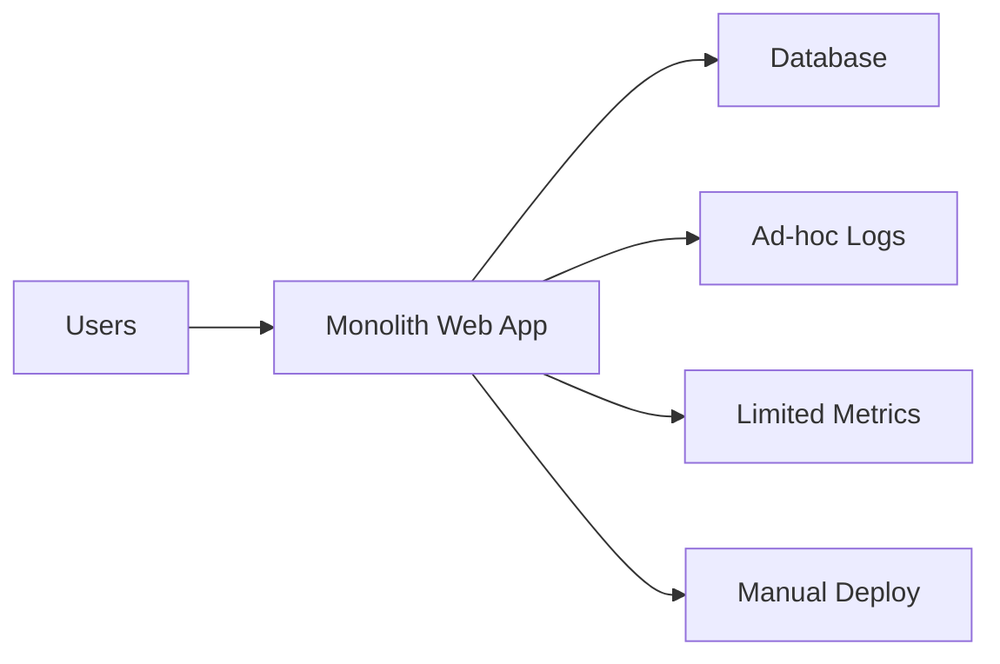
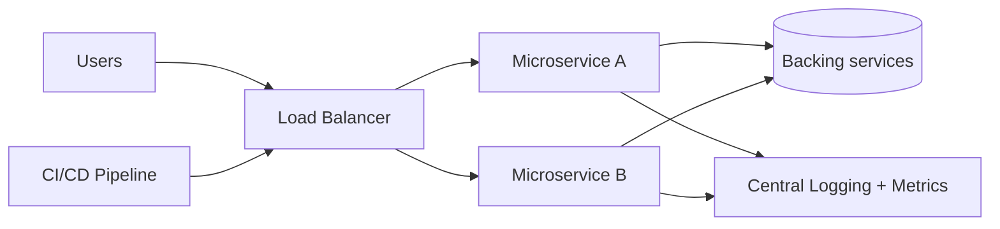

## Agentic AI-Enhanced DevOps Automation (Assignment 2)

**Student:** <your name>  
**Repository:** [kd-crypto162/AGENTIC_AI-ENHANCED](https://github.com/kd-crypto162/AGENTIC_AI-ENHANCED)  
**Date:** <date>

### 1) Modernisation Analysis (Before / After)

Legacy system selected: **Monolith E-commerce application**

#### Before (monolith)

- Scalability bottleneck: a single deployable unit means slow releases.
- Observability gaps: inconsistent logging and missing metrics across modules.
- Tooling friction: deployments and rollbacks are manual and error-prone.

Mermaid “Before” diagram:



#### After (cloud-native)

- Decompose into microservices.
- Add centralized logging + metrics.
- Use automated CI/CD with container images.

Mermaid “After” diagram:



### 2) Cloud-Native Design

Proposed microservices:

- `catalog-service`
- `order-service`
- `payment-service`
- `user-service`
- `notification-service`

#### Kubernetes orchestration + scaling

- Use Deployments for steady scaling.
- Use HPA (Horizontal Pod Autoscaler) based on CPU/memory and custom metrics (RPS, error rate).

#### 12-Factor App Principles (config + backing services)

- Config via environment variables (12-factor “config”).
- Backing services (DB/Redis) accessed via service discovery + connection strings in environment.
- No secrets in images; secrets injected at runtime.

#### Deployment model choice (Blue-Green)

- Blue environment handles current production traffic.
- CI builds a new image and deploys it to Green.
- Run smoke tests (ex: `/health`) before switching traffic.
- Rollback is just switching traffic back to Blue.

Why Blue-Green:
- reduces risk,
- improves rollback safety,
- gives a stable fallback.

### 3) Build a DevOps AI Agent

Agent requirement met: the agent classifies **CI/CD failure reasons from logs**.

Agent behavior:

1. Planning step: selects keywords/patterns it will search for.
2. Tool call step: searches the log text for those patterns.
3. Self-reflection step: checks what evidence exists and whether the classification makes sense.
4. Final answer: category + recommended fixes.

Run:

```bash
python -m agent.run_agent --log-file agent/sample_ci_log.txt
```

What to screenshot:
- The console output showing Planning, Tool call, Self-reflection, and Final answer.

### 4) Agile Project Management (Scrum)

#### Product Backlog (INVEST user stories)

- As a developer, I want CI failures to be categorized automatically so I can fix issues faster.
- As a DevOps engineer, I want an agent to suggest likely fixes so I reduce manual debugging time.
- As a team, we want standardized CI artifacts (coverage + SAST reports) to speed up review.

#### Sprint retrospective (example)

Process improvement made:
- We changed our workflow to always print and store the last Gradle output lines, so failures are easier to diagnose.

